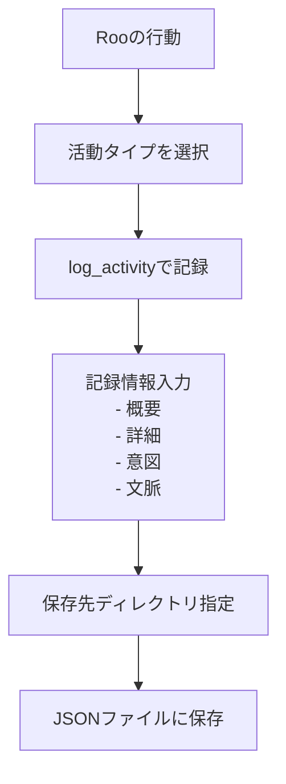
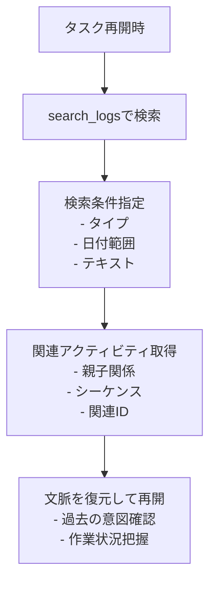

# Roo Activity Logger

[English version here](./README.md)

## TL;DR

- **これは何？**: Roo の活動（コマンド実行、コード生成など）を自動記録するための **MCP サーバー** です。
- **何ができる？**: 活動履歴を JSON 形式で保存し、後から検索・分析できます。
- **どう使う？**: Cline や Roo-Code の設定に追加して、Roo の活動を自動記録させます。

## 概要

Roo Activity Logger は、Roo の開発活動（コマンド実行、コード生成、ファイル操作など）を自動的に記録する MCP (Model Context Protocol) サーバーです。
全てのログは JSON 形式で保存されるため、いつでも簡単に検索、分析、文脈の復元が可能です。

### アクティビティ記録の仕組み



### タスク再開時のログ検索と文脈復元方法



### ログエントリのサンプル

以下は、JSON として保存される `file_operation` ログエントリの例です。

```json
{
  "id": "75add15d-8d5b-4e60-b327-fde785050c86",
  "timestamp": "2025-04-10T01:58:02.905Z",
  "type": "file_operation",
  "level": "info",
  "summary": "README.mdにmermaid図を挿入完了",
  "details": {
    "file": "README.md",
    "operation": "insert_content",
    "insertedLines": "mermaidコードブロック",
    "position": "概要セクション直後"
  },
  "intention": "アクティビティの保存と呼び出しの流れを視覚的に説明するため",
  "context": "Roo Activity Loggerの利用者理解促進のためのドキュメント改善作業",
  "parentId": "98280366-1de1-48e0-9914-b3a3409599b4"
}
```

各ログには以下が含まれます:

- ログレベル (`debug`, `info`, `warn`, `error`)
- 概要
- 詳細情報（任意の構造データ）
- 活動の意図・目的
- 活動の文脈情報
- 親アクティビティの ID（階層関係用）
- シーケンス番号（関連アクティビティの順序）
- 関連アクティビティの ID 配列（グループ化用）

ログは:

- **保存**: 日付ベースの JSON ファイルに保存されます
- **検索**: タイプ、レベル、日付、テキストなどで検索可能です
- **カスタマイズ可能**: 活動ごとに異なる保存先ディレクトリを指定できます

## 機能

- **様々な活動タイプを記録:**
  - コマンド実行 (`command_execution`)
  - コード生成 (`code_generation`)
  - ファイル操作 (`file_operation`)
  - エラー発生 (`error_encountered`)
  - 判断記録 (`decision_made`)
  - 会話記録 (`conversation`)

- **各活動ログに含まれる情報:**
  - 一意の ID
  - タイムスタンプ
  - 活動タイプ
  - 概要、詳細、意図、文脈、およびオプションのメタデータ

## 使用方法 (推奨: `npx` を使用)

`npx` を使うことで、リポジトリをクローンせずに直接 Roo Activity Logger を実行できます。

Cline または Roo-Code の設定に以下を追加します:

```json
{
  "mcpServers": {
    "roo-activity-logger": {
      "command": "npx",
      "args": ["-y", "github:annenpolka/roo-logger"],
      "env": {},
      "disabled": false
    }
  }
}
```

その後、ルールファイル等にログを書き出す旨のプロンプトを追加してください。（以下はプロンプトの例）

```md
## 重要

どんな時も必ずログ記録のルールに従い、roo-activity-logger を使用してログを記録してください。

## 作業開始準備

`git status` で現在のコンテキストを確認します。

その後、logs/を roo-activity-logger で search_logs を使って確認して、現在のタスクを特定します。

ログ記録の項目を必ず実行してください。

## ログ記録

- 全てのログは roo-activity-logger を使用して記録してください
- ログにはスタックトレースと実行コンテキストを含めてください
- 意図と文脈情報を記録してください
```

---

## 開発者向け: ローカルでのセットアップ

ローカルで開発やカスタマイズを行う場合は、リポジトリをクローンしてビルドします:

```bash
# リポジトリのクローン (yourusername を実際のユーザー名/組織名に置き換えてください)
git clone https://github.com/annenpolka/roo-logger.git
cd roo-logger

# 依存パッケージのインストール
npm install

# ビルド
npm run build
```

ローカルビルドを使用する場合の設定例:

```json
{
  "mcpServers": {
    "roo-activity-logger": {
      "command": "node",
      "args": ["/path/to/your/local/roo-logger/dist/index.js"], // パスを適宜調整してください
      "env": {},
      "disabled": false
    }
  }
}
```

### 注意事項

- 指定したディレクトリが存在しない場合は自動的に作成されます

---

## MCP ツール

### `log_activity` — 活動の記録

活動を記録するためのツールです。

#### 基本的な使用例

```json
{
  "type": "command_execution",
  "summary": "npmコマンドを実行",
  "intention": "プロジェクトの依存関係を更新するため",
  "context": "新機能実装のための準備作業として",
  "logsDir": "/absolute/path/to/logs/activity"
}
```

#### パラメータ

| 名前         | 必須 | 型       | 説明                                                                                                                         |
| ------------ | ---- | -------- | ---------------------------------------------------------------------------------------------------------------------------- |
| `type`       | ✅   | string   | 活動の種類（`command_execution`, `code_generation`, `file_operation`, `error_encountered`, `decision_made`, `conversation`） |
| `summary`    | ✅   | string   | 活動の簡単な要約                                                                                                             |
| `intention`  | ✅   | string   | 目的または意図                                                                                                               |
| `context`    | ✅   | string   | 文脈情報                                                                                                                     |
| `logsDir`    | ✅   | string   | 保存先ディレクトリ（**絶対パスのみ**）                                                                                       |
| `level`      | ❌   | string   | ログレベル（`debug`, `info`, `warn`, `error`）。デフォルト: `info`                                                           |
| `details`    | ❌   | object   | 追加の詳細情報（任意の JSON）                                                                                                |
| `parentId`   | ❌   | string   | 親アクティビティ ID                                                                                                          |
| `sequence`   | ❌   | number   | シーケンス番号                                                                                                               |
| `relatedIds` | ❌   | string[] | 関連アクティビティ ID 配列                                                                                                   |

#### 詳細な使用例

```json
{
  "type": "file_operation",
  "summary": "READMEファイルの更新",
  "intention": "ドキュメントを明確化して使いやすくするため",
  "context": "ユーザーフィードバックに基づく改善作業の一環として",
  "level": "info",
  "details": {
    "file": "README.md",
    "operation": "update",
    "changedLines": 15
  },
  "logsDir": "/absolute/path/to/logs/activity",
  "sequence": 3,
  "relatedIds": ["11223344-5566-7788-99aa-bbccddeeff00"]
}
```

---

### `get_log_files` — 保存されたログファイルの一覧を取得

保存されたログファイルを再帰的に一覧表示します。最大検索深度を指定できます。

#### 基本的な使用例

```json
{
  "logsDir": "/absolute/path/to/logs"
}
```

#### パラメータ

| 名前               | 必須 | 型     | 説明                                                                        |
| ------------------ | ---- | ------ | --------------------------------------------------------------------------- |
| `logsDir`          | ✅   | string | 検索するディレクトリ（絶対パスのみ）                                        |
| `limit`            | ❌   | number | 取得する最大ファイル数（デフォルト: 10）                                    |
| `offset`           | ❌   | number | スキップするファイル数（デフォルト: 0）                                     |
| `logFilePrefix`    | ❌   | string | ログファイル名のプレフィックス（デフォルト: `"roo-activity-"`）             |
| `logFileExtension` | ❌   | string | ログファイルの拡張子（デフォルト: `".json"`）                               |
| `maxDepth`         | ❌   | number | 最大ディレクトリ深度（デフォルト: 3）                                       |

---

### `search_logs` — 保存されたログの検索

様々なフィルターを使用して保存されたログを検索します。

#### 基本的な使用例

```json
{
  "logsDir": "/absolute/path/to/logs"
}
```

```json
{
  "logsDir": "/absolute/path/to/logs",
  "type": "command_execution"
}
```

#### パラメータ

| 名前               | 必須 | 型       | 説明                                                                                                                                         |
| ------------------ | ---- | -------- | -------------------------------------------------------------------------------------------------------------------------------------------- |
| `logsDir`          | ✅   | string   | ログディレクトリ（絶対パスのみ）                                                                                                             |
| `logFilePrefix`    | ❌   | string   | ログファイル名のプレフィックス（デフォルト: `"roo-activity-"`）                                                                                |
| `logFileExtension` | ❌   | string   | ログファイルの拡張子（デフォルト: `".json"`）                                                                                                  |
| `type`             | ❌   | string   | 活動タイプでフィルタリング（`command_execution`, `code_generation`, `file_operation`, `error_encountered`, `decision_made`, `conversation`） |
| `level`            | ❌   | string   | ログレベルでフィルタリング（`debug`, `info`, `warn`, `error`）                                                                               |
| `startDate`        | ❌   | string   | 開始日（YYYY-MM-DD 形式）                                                                                                                    |
| `endDate`          | ❌   | string   | 終了日（YYYY-MM-DD 形式）                                                                                                                    |
| `searchText`       | ❌   | string   | 概要または詳細に含まれるテキストで検索                                                                                                       |
| `limit`            | ❌   | number   | 取得する最大ログ数（デフォルト: 50）                                                                                                         |
| `offset`           | ❌   | number   | スキップするログ数（デフォルト: 0）                                                                                                          |
| `parentId`         | ❌   | string   | 親アクティビティ ID でフィルタリング                                                                                                         |
| `sequenceFrom`     | ❌   | number   | シーケンス番号の下限値                                                                                                                       |
| `sequenceTo`       | ❌   | number   | シーケンス番号の上限値                                                                                                                       |
| `relatedId`        | ❌   | string   | 関連アクティビティ ID でフィルタリング                                                                                                       |
| `relatedIds`       | ❌   | string[] | これらの関連アクティビティ ID のいずれかでフィルタリング                                                                                     |

---

## ライセンス

MIT