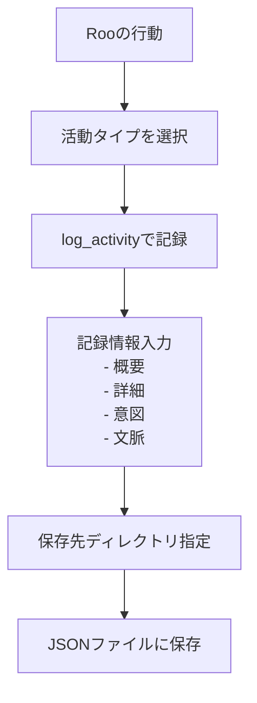
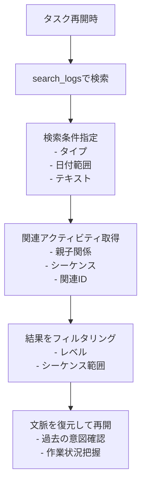

# Roo Activity Logger

## TL;DR

- **これは何？**: Roo の活動（コマンド実行、コード生成など）を記録するための
  **MCP サーバー** です。
- **何ができる？**: 活動履歴を JSON 形式で保存し、後から検索・分析できます。
- **どう使う？**: Cline/Roo-Code の設定に追加して、Roo
  の活動を自動記録させます。

Roo の活動を自動的に記録する MCP サーバー

## 概要

### 作業時のアクティビティ記録フロー



### タスク再開時の履歴検索と文脈復元フロー



このプロジェクトは、Roo による開発活動を記録するための Model Context
Protocol（MCP）サーバーを提供します。コマンド実行、コード生成、ファイル操作などの活動を自動的に記録し、後から検索・分析できるようにします。

### ログデータのサンプル

以下は、`file_operation`タイプのログの例です。実際のログは JSON 形式で保存されます。

```json
{
  "id": "75add15d-8d5b-4e60-b327-fde785050c86",
  "timestamp": "2025-04-10T01:58:02.905Z",
  "type": "file_operation",
  "level": "info",
  "summary": "README.mdにmermaid図を挿入完了",
  "details": {
    "file": "README.md",
    "operation": "insert_content",
    "insertedLines": "mermaidコードブロック",
    "position": "概要セクション直後"
  },
  "intention": "アクティビティの保存と呼び出しの流れを視覚的に説明するため",
  "context": "Roo Activity Loggerの利用者理解促進のためのドキュメント改善作業",
  "parentId": "98280366-1de1-48e0-9914-b3a3409599b4"
}
```

このように、各ログには一意の ID、タイムスタンプ、活動タイプ、詳細情報、意図、文脈などが記録されます。

- ログレベル (debug, info, warn, error)
- 概要
- 詳細情報（任意の構造データ）
- 活動の意図・目的
- 活動の文脈情報
- 親アクティビティの ID（階層関係用）
- シーケンス番号（関連アクティビティの順序）
- 関連アクティビティの ID 配列（グループ化用）

- **保存**: 日付ベースの JSON ファイルに保存

- **検索**: タイプ、レベル、日付、テキストなどで検索可能

- **カスタムディレクトリ**: 活動ごとに保存先を指定可能

## 機能

- **活動記録**: 様々な種類の活動を記録

  - コマンド実行 (`command_execution`)
  - コード生成 (`code_generation`)
  - ファイル操作 (`file_operation`)
  - エラー発生 (`error_encountered`)
  - 判断記録 (`decision_made`)
  - 会話記録 (`conversation`)

- **記録情報**: 各活動について以下の情報を記録

  - 一意の ID
  - タイムスタンプ
  - 活動タイプ

## 使用方法 (推奨: npx を使用)

`npx` を使うことで、リポジトリをクローンせずに直接 MCP サーバーを実行できます。

Cline (もしくは Roo-Code) の設定ファイルに以下を追加します：

```json
{
  "mcpServers": {
    "roo-activity-logger": {
      "command": "npx",
      "args": ["-y", "github:annenpolka/roo-logger"],
      "env": {},
      "disabled": false
    }
  }
}
```

その後、ルールファイル等にログを書き出す旨のプロンプトを追加してください。（以下はプロンプトの例）

```md
## 重要

どんな時も必ずログ記録のルールに従い、roo-activity-logger を使用してログを記録してください。

## 作業開始準備

`git status` で現在のコンテキストを確認します。

その後、logs/を roo-activity-logger で search_logs を使って確認して、現在のタスクを特定します。

ログ記録の項目を必ず実行してください。

## ログ記録

- 全てのログは roo-activity-logger を使用して記録してください
- ログにはスタックトレースと実行コンテキストを含めてください
- 意図と文脈情報を記録してください
```

---

## 開発者向け: ローカルでのセットアップ

リポジトリをローカルにクローンして開発やカスタマイズを行う場合は、以下の手順を実行します。

```bash
# リポジトリのクローン (yourusername を実際のユーザー名/組織名に置き換えてください)
git clone https://github.com/annenpolka/roo-logger.git
cd roo-logger

# 依存パッケージのインストール
npm install

# ビルド
npm run build
```

ローカルでビルドしたサーバーを使用する場合の設定例:

```json
{
  "mcpServers": {
    "roo-activity-logger": {
      "command": "node",
      "args": ["/path/to/your/local/roo-logger/dist/index.js"], // クローンしたパスに合わせて変更
      "env": {},
      "disabled": false
    }
  }
}
```

### 注意事項

- デフォルトでは、プロジェクトルートディレクトリの 'logs'
  フォルダにログが保存されます
- 指定したディレクトリが存在しない場合は自動的に作成されます

```bash
# このコードブロックに言語指定を追加
```

## MCP ツールの使用方法

### log_activity - 活動の記録

活動を記録するためのツールです。

#### 基本的な使用例

```javascript
// 必須パラメータを指定した最小限の呼び出し
{
  "type": "command_execution",
  "summary": "npmコマンドを実行",
  "intention": "プロジェクトの依存関係を更新するため",
  "context": "新機能実装のための準備作業として",
  "logsDir": "/absolute/path/to/logs/activity"
}
```

#### log_activity のパラメータ一覧

| パラメータ名 | 必須 | 型       | 説明                                                                                                                         |
| ------------ | ---- | -------- | ---------------------------------------------------------------------------------------------------------------------------- |
| `type`       | ✅   | string   | 活動の種類（`command_execution`, `code_generation`, `file_operation`, `error_encountered`, `decision_made`, `conversation`） |
| `summary`    | ✅   | string   | 活動の要約                                                                                                                   |
| `intention`  | ✅   | string   | 活動を行う意図・目的を説明するテキスト                                                                                       |
| `context`    | ✅   | string   | 活動の文脈情報を説明するテキスト                                                                                             |
| `logsDir`    | ✅   | string   | 保存先ディレクトリ（**必須・絶対パスのみ**）                                                                                 |
| `level`      | ❌   | string   | ログレベル（`debug`, `info`, `warn`, `error`）。デフォルト: `info`                                                           |
| `details`    | ❌   | object   | 活動の詳細情報（任意の JSON 構造）                                                                                           |
| `parentId`   | ❌   | string   | 親アクティビティ ID                                                                                                          |
| `sequence`   | ❌   | number   | シーケンス番号                                                                                                               |
| `relatedIds` | ❌   | string[] | 関連アクティビティ ID 配列                                                                                                   |

#### 意図と文脈の記録の重要性

`.clinerules` にも記載されている通り、活動ログには**意図 (intention)** と **文脈 (context)** を含めることが非常に重要です。これにより、後からログを見返した際に「なぜこの作業を行ったのか」「どのような状況下での判断だったのか」を正確に把握でき、タスクの引き継ぎや問題発生時の原因究明に役立ちます。

以下は、意図と文脈を意識した `log_activity` の思考プロセス例です。

```text
// 思考プロセス例: なぜこのログを記録するのか？
// 意図: ユーザーからのフィードバックに基づき、ログイン処理のエラーハンドリングを改善するため。
// 文脈: 現在、特定のエラーケースでユーザーに不親切なメッセージが表示される問題があり、その修正作業の一環。
//
// これを踏まえて log_activity を呼び出す...
{
  "type": "code_generation",
  "summary": "ログインエラーハンドリングの改善コードを生成",
  "intention": "特定のエラーケースでより親切なフィードバックをユーザーに提供するため",
  "context": "ユーザーからの報告（チケット#123）に基づくエラー処理改善タスク",
  "details": { "function": "handleLoginError", "file": "src/auth.ts" },
  "logsDir": "/absolute/path/to/logs/code"
}
```

単に作業内容を記録するだけでなく、その背景にある思考プロセスを言語化して記録することを心がけましょう。

#### log_activity の詳細な使用例

```javascript
// すべてのパラメータを使った詳細な活動記録
{
  "type": "file_operation",
  "summary": "READMEファイルの更新",
  "intention": "ドキュメントを明確化して使いやすくするため",
  "context": "ユーザーフィードバックに基づく改善作業の一環として",
  "level": "info",
  "details": {
    "file": "README.md",
    "operation": "update",
    "changedLines": 15
  },
  "logsDir": "/absolute/path/to/logs/activity",
  "sequence": 3,
  "relatedIds": ["11223344-5566-7788-99aa-bbccddeeff00"]
}
```

### get_log_files - ログファイル一覧の取得

保存されたログファイルの一覧を取得するためのツールです。指定されたディレクトリから再帰的にログファイルを検索し、深さ
(`maxDepth`) を指定することも可能です。

#### get_log_files の基本的な使用例

```javascript
// 必須パラメータを指定（絶対パスのログディレクトリ）
{
  "logsDir": "/absolute/path/to/logs"
}
```

#### get_log_files のパラメータ一覧

| パラメータ名       | 必須 | 型     | 説明                                                                        |
| ------------------ | ---- | ------ | --------------------------------------------------------------------------- |
| `logsDir`          | ✅   | string | ログファイルを検索するディレクトリパス（絶対パスのみ）                      |
| `limit`            | ❌   | number | 取得する最大ファイル数。デフォルト: `10`                                    |
| `offset`           | ❌   | number | スキップするファイル数。デフォルト: `0`                                     |
| `logFilePrefix`    | ❌   | string | ログファイル名のプレフィックス。デフォルト: `"roo-activity-"`               |
| `logFileExtension` | ❌   | string | ログファイルの拡張子。デフォルト: `".json"`                                 |
| `maxDepth`         | ❌   | number | 探索するディレクトリの最大深度（0 は指定ディレクトリのみ）。デフォルト: `3` |

#### get_log_files の詳細な使用例

```javascript
// カスタムパラメータを指定して呼び出し
{
  "logsDir": "/absolute/path/to/logs",
  "limit": 5,
  "offset": 10,
  "logFilePrefix": "custom-log-",
  "logFileExtension": ".jsonl",
  "maxDepth": 1 // 深さ1まで（logsDir直下とその1階層下）を検索
}
```

### search_logs - ログの検索

保存されたログを様々な条件で検索するためのツールです。logsDir（絶対パス）パラメータが必須で、その他のフィルタリングパラメータは任意です。

#### search_logs の基本的な使用例

```javascript
// 必須パラメータのみ指定 - 指定ディレクトリの最新50件を取得
{
  "logsDir": "/absolute/path/to/logs"
}

// 活動タイプでのフィルタリング
{
  "logsDir": "/absolute/path/to/logs",
  "type": "command_execution"
}
```

#### search_logs のパラメータ一覧

| パラメータ名       | 必須 | 型       | 説明                                                                                                                                         |
| ------------------ | ---- | -------- | -------------------------------------------------------------------------------------------------------------------------------------------- |
| `logsDir`          | ✅   | string   | ログディレクトリ（絶対パスのみ）                                                                                                             |
| `logFilePrefix`    | ❌   | string   | ログファイル名のプレフィックス。デフォルト: `"roo-activity-"`                                                                                |
| `logFileExtension` | ❌   | string   | ログファイルの拡張子。デフォルト: `".json"`                                                                                                  |
| `type`             | ❌   | string   | 活動タイプでフィルタリング（`command_execution`, `code_generation`, `file_operation`, `error_encountered`, `decision_made`, `conversation`） |
| `level`            | ❌   | string   | ログレベルでフィルタリング（`debug`, `info`, `warn`, `error`）                                                                               |
| `startDate`        | ❌   | string   | 検索開始日（YYYY-MM-DD 形式）                                                                                                                |
| `endDate`          | ❌   | string   | 検索終了日（YYYY-MM-DD 形式）                                                                                                                |
| `searchText`       | ❌   | string   | ログの概要または詳細に含まれるテキストで検索                                                                                                 |
| `limit`            | ❌   | number   | 取得する最大ログ数。デフォルト: `50`                                                                                                         |
| `offset`           | ❌   | number   | スキップするログ数。デフォルト: `0`                                                                                                          |
| `parentId`         | ❌   | string   | 特定の親アクティビティに関連するログのみを取得                                                                                               |
| `sequenceFrom`     | ❌   | number   | シーケンス番号の下限値                                                                                                                       |
| `sequenceTo`       | ❌   | number   | シーケンス番号の上限値                                                                                                                       |
| `relatedId`        | ❌   | string   | 特定の ID が関連 IDs に含まれるログを検索                                                                                                    |
| `relatedIds`       | ❌   | string[] | これらの ID のいずれかが関連 IDs に含まれるログを検索                                                                                        |

#### search_logs の複合条件での使用例

```javascript
// タイプとレベルを組み合わせたフィルタリング
{
  "logsDir": "/absolute/path/to/logs",
  "type": "file_operation",
  "level": "info"
}

// 日付範囲とテキスト検索の組み合わせ
{
  "logsDir": "/absolute/path/to/logs",
  "startDate": "2025-01-01",
  "endDate": "2025-03-31",
  "searchText": "webpack"
}

// 高度なフィルタリング
{
  "logsDir": "/absolute/path/to/logs",
  "logFilePrefix": "custom-",
  "type": "code_generation",
  "startDate": "2025-03-01",
  "endDate": "2025-03-14",
  "searchText": "React",
  "limit": 20,
  "sequenceFrom": 1,
  "sequenceTo": 10
}
```

#### search_logs の階層関係・関連性による検索

```javascript
// 親子関係による検索
{
  "logsDir": "/absolute/path/to/logs",
  "parentId": "00112233-4455-6677-8899-aabbccddeeff"
}

// 関連アクティビティによる検索
{
  "logsDir": "/absolute/path/to/logs",
  "relatedId": "11223344-5566-7788-99aa-bbccddeeff00"
}

// 複数の関連アクティビティのいずれかに関連するログの検索
{
  "logsDir": "/absolute/path/to/logs",
  "relatedIds": [
    "11223344-5566-7788-99aa-bbccddeeff00",
    "22334455-6677-8899-aabb-ccddeeff1122"
  ]
}
```

## ライセンス

MIT
