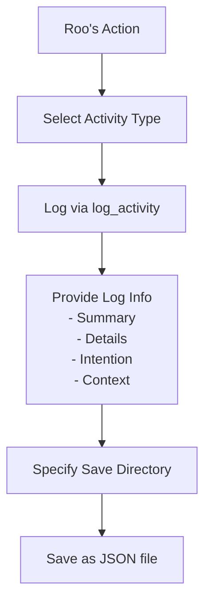
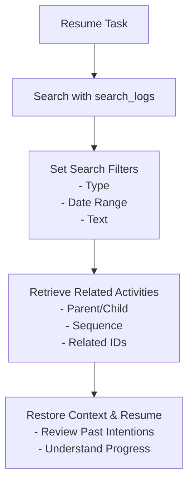

[](https://mseep.ai/app/annenpolka-roo-logger)

# Roo Activity Logger

[日本語版はこちら](./README.ja.md)

## TL;DR

- **What is it?** — This is an **MCP server** that automatically logs Roo Code(Cline)'s activities, such as command executions and code generation.
- **What does it do?** — It saves activity history as JSON files, which you can search and analyze later.
- **How do I use it?** — Add it to your Cline or Roo-Code settings to enable automatic activity logging.

## Overview

Roo Activity Logger is an MCP (Model Context Protocol) server that automatically records Roo's development activities — including command executions, code generation, file operations, and more.
All logs are saved in JSON format, making it easy to search, analyze, and restore context at any time.

### How activity logging works



### How to search logs and restore context when resuming a task



### Sample Log Entry

Here is an example of a `file_operation` log entry saved as JSON:

```json
{
  "id": "75add15d-8d5b-4e60-b327-fde785050c86",
  "timestamp": "2025-04-10T01:58:02.905Z",
  "type": "file_operation",
  "level": "info",
  "summary": "Inserted mermaid diagram into README.md",
  "details": {
    "file": "README.md",
    "operation": "insert_content",
    "insertedLines": "mermaid code block",
    "position": "after overview section"
  },
  "intention": "To visually explain the flow of saving and retrieving activities",
  "context": "Improving documentation for Roo Activity Logger",
  "parentId": "98280366-1de1-48e0-9914-b3a3409599b4"
}
```

Each log contains:

- Log level (`debug`, `info`, `warn`, `error`)
- Summary
- Details (any structured data)
- Intention / Purpose
- Context information
- Parent activity ID (for hierarchy)
- Sequence number (for ordering)
- Related activity IDs (for grouping)

Logs are:

- **Saved** as date-based JSON files
- **Searchable** by type, level, date, text, etc.
- **Customizable** — you can specify different save directories per activity

## Features

- **Logs various activity types:**
  - Command executions (`command_execution`)
  - Code generation (`code_generation`)
  - File operations (`file_operation`)
  - Errors (`error_encountered`)
  - Decisions (`decision_made`)
  - Conversations (`conversation`)

- **Each activity log includes:**
  - Unique ID
  - Timestamp
  - Activity type
  - Summary, details, intention, context, and optional metadata

## Usage (Recommended: via `npx`)

You can run Roo Activity Logger directly without cloning the repository by using `npx`.

Add this to your Cline or Roo-Code configuration:

```json
{
  "mcpServers": {
    "roo-activity-logger": {
      "command": "npx",
      "args": ["-y", "github:annenpolka/roo-logger"],
      "env": {},
      "disabled": false
    }
  }
}
```

Then, add prompts to your rule files to ensure logging, for example:

```md
## Important

Always log activities using roo-activity-logger according to the logging rules.

## Preparation

Check the current context with `git status`.

Then, use roo-activity-logger's `search_logs` to review existing logs and identify current tasks.

Be sure to perform the logging steps.

## Logging

- Always use roo-activity-logger for all logs
- Include stack traces and execution context
- Record intention and context
```

---

## For Developers: Local Setup

To develop or customize locally, clone the repository and build:

```bash
# Clone the repo (replace yourusername with your actual username/org)
git clone https://github.com/annenpolka/roo-logger.git
cd roo-logger

# Install dependencies
npm install

# Build
npm run build
```

Example configuration to use your local build:

```json
{
  "mcpServers": {
    "roo-activity-logger": {
      "command": "node",
      "args": ["/path/to/your/local/roo-logger/dist/index.js"], // adjust path accordingly
      "env": {},
      "disabled": false
    }
  }
}
```

### Notes

- The specified directory will be created automatically if it does not exist.

---

## MCP Tools

### `log_activity` — Record an activity

A tool to record an activity.

#### Basic example

```json
{
  "type": "command_execution",
  "summary": "Run npm command",
  "intention": "Update project dependencies",
  "context": "Preparing for new feature development",
  "logsDir": "/absolute/path/to/logs/activity"
}
```

#### Parameters

| Name         | Required | Type     | Description                                                                                                         |
| ------------ | -------- | -------- | ------------------------------------------------------------------------------------------------------------------- |
| `type`       | Yes      | string   | Activity type (`command_execution`, `code_generation`, `file_operation`, `error_encountered`, `decision_made`, `conversation`) |
| `summary`    | Yes      | string   | Short summary of the activity                                                                                      |
| `intention`  | Yes      | string   | Purpose or intention                                                                                               |
| `context`    | Yes      | string   | Context information                                                                                                |
| `logsDir`    | Yes      | string   | Save directory (**absolute path only**)                                                                            |
| `level`      | No       | string   | Log level (`debug`, `info`, `warn`, `error`). Default: `info`                                                      |
| `details`    | No       | object   | Additional details (any JSON)                                                                                      |
| `parentId`   | No       | string   | Parent activity ID                                                                                                 |
| `sequence`   | No       | number   | Sequence number                                                                                                    |
| `relatedIds` | No       | string[] | Related activity IDs                                                                                               |

#### Detailed example

```json
{
  "type": "file_operation",
  "summary": "Update README file",
  "intention": "Clarify documentation and improve usability",
  "context": "Improvements based on user feedback",
  "level": "info",
  "details": {
    "file": "README.md",
    "operation": "update",
    "changedLines": 15
  },
  "logsDir": "/absolute/path/to/logs/activity",
  "sequence": 3,
  "relatedIds": ["11223344-5566-7788-99aa-bbccddeeff00"]
}
```

---

### `get_log_files` — List saved log files

Lists saved log files recursively. You can specify the maximum search depth.

#### Basic example

```json
{
  "logsDir": "/absolute/path/to/logs"
}
```

#### Parameters

| Name               | Required | Type    | Description                                                        |
| ------------------ | -------- | ------- | ------------------------------------------------------------------ |
| `logsDir`          | Yes      | string  | Directory to search (absolute path only)                           |
| `limit`            | No       | number  | Max files to retrieve (default: 10)                               |
| `offset`           | No       | number  | Number of files to skip (default: 0)                              |
| `logFilePrefix`    | No       | string  | Log file prefix (default: `"roo-activity-"`)                      |
| `logFileExtension` | No       | string  | Log file extension (default: `".json"`)                           |
| `maxDepth`         | No       | number  | Max directory depth (default: 3)                                  |

---

### `search_logs` — Search saved logs

Searches saved logs with various filters.

#### Basic example

```json
{
  "logsDir": "/absolute/path/to/logs"
}
```

```json
{
  "logsDir": "/absolute/path/to/logs",
  "type": "command_execution"
}
```

#### Parameters

| Name               | Required | Type      | Description                                                                                                         |
| ------------------ | -------- | --------- | ------------------------------------------------------------------------------------------------------------------- |
| `logsDir`          | Yes      | string    | Log directory (absolute path only)                                                                                  |
| `logFilePrefix`    | No       | string    | Log file prefix (default: `"roo-activity-"`)                                                                       |
| `logFileExtension` | No       | string    | Log file extension (default: `".json"`)                                                                            |
| `type`             | No       | string    | Filter by activity type (`command_execution`, `code_generation`, `file_operation`, `error_encountered`, `decision_made`, `conversation`) |
| `level`            | No       | string    | Filter by log level (`debug`, `info`, `warn`, `error`)                                                             |
| `startDate`        | No       | string    | Start date (YYYY-MM-DD)                                                                                            |
| `endDate`          | No       | string    | End date (YYYY-MM-DD)                                                                                              |
| `searchText`       | No       | string    | Search text in summary or details                                                                                  |
| `limit`            | No       | number    | Max logs to retrieve (default: 50)                                                                                 |
| `offset`           | No       | number    | Number of logs to skip (default: 0)                                                                                |
| `parentId`         | No       | string    | Filter by parent activity ID                                                                                       |
| `sequenceFrom`     | No       | number    | Sequence number lower bound                                                                                        |
| `sequenceTo`       | No       | number    | Sequence number upper bound                                                                                        |
| `relatedId`        | No       | string    | Filter by related activity ID                                                                                      |
| `relatedIds`       | No       | string[]  | Filter by any of related activity IDs                                                                              |

---

## License

MIT
