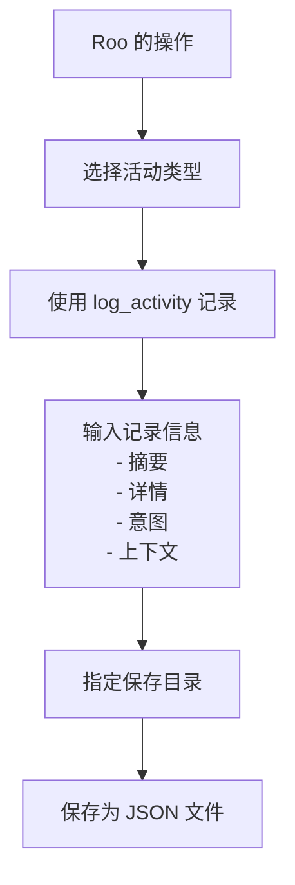
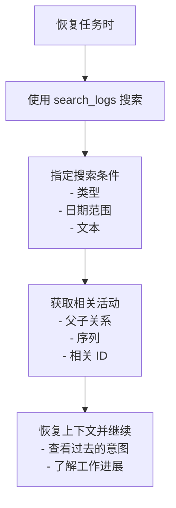

# Roo Activity Logger

[English version](./README.en.md) | [日本語版](./README.ja.md)

## TL;DR

- **这是什么？**: 这是一个 **MCP 服务器**，用于自动记录 AI 编程助手的活动（如命令执行、代码生成等），支持 Roo Code、Cline、Claude Code 等。
- **它能做什么？**: 它可以将活动历史以 JSON 格式保存，以便日后搜索和分析。
- **如何使用？**: 将其添加到 Claude Code、Cline 或 Roo-Code 的设置中，以自动记录 AI 助手的活动。

## 概述

Roo Activity Logger 是一个 MCP (Model Context Protocol) 服务器，可以自动记录 AI 编程助手的开发活动，包括命令执行、代码生成、文件操作等。它支持 Claude Code、Cline、Roo-Code 以及其他兼容 MCP 的 AI 助手。
所有日志都以 JSON 格式保存，方便随时搜索、分析和恢复上下文。

### 活动记录流程



### 任务恢复时搜索日志与恢复上下文的方法



### 日志条目示例

以下是保存为 JSON 的 `file_operation` 日志条目示例：

```json
{
  "id": "75add15d-8d5b-4e60-b327-fde785050c86",
  "timestamp": "2025-04-10T01:58:02.905Z",
  "type": "file_operation",
  "level": "info",
  "summary": "已在 README.md 中插入 mermaid 图表",
  "details": {
    "file": "README.md",
    "operation": "insert_content",
    "insertedLines": "mermaid 代码块",
    "position": "概述部分之后"
  },
  "intention": "为了直观地解释保存和检索活动的流程",
  "context": "为 Roo Activity Logger 的用户改进文档",
  "parentId": "98280366-1de1-48e0-9914-b3a3409599b4"
}
```

每个日志包含：

- 日志级别 (`debug`, `info`, `warn`, `error`)
- 摘要
- 详细信息（任意结构化数据）
- 活动的意图/目的
- 活动的上下文信息
- 父活动的 ID（用于层级关系）
- 序列号（用于相关活动的排序）
- 相关活动的 ID 数组（用于分组）

日志的特点：

- **保存**: 以基于日期的 JSON 文件保存
- **搜索**: 可按类型、级别、日期、文本等进行搜索
- **可定制**: 可为每个活动指定不同的保存目录

## 功能

- **记录多种活动类型:**
  - 命令执行 (`command_execution`)
  - 代码生成 (`code_generation`)
  - 文件操作 (`file_operation`)
  - 错误记录 (`error_encountered`)
  - 决策记录 (`decision_made`)
  - 对话记录 (`conversation`)

- **每个活动日志包含的信息:**
  - 唯一 ID
  - 时间戳
  - 活动类型
  - 摘要、详情、意图、上下文及可选元数据

## 使用方法 (推荐: 使用 `npx`)

使用 `npx` 可以直接运行 Roo Activity Logger，无需克隆仓库。

将以下配置添加到您的 AI 编程助手的 MCP 设置中：

```json
{
  "mcpServers": {
    "roo-activity-logger": {
      "command": "npx",
      "args": ["-y", "github:annenpolka/roo-logger"],
      "env": {},
      "disabled": false
    }
  }
}
```

然后，在设置文件或 AI 编程助手的提示中添加记录日志的指令（以下为提示示例）：

```md
## 重要

请务必始终遵循日志记录规则，并使用 roo-activity-logger 记录日志。

## 准备工作

使用 `git status` 检查当前上下文。

然后，使用 roo-activity-logger 的 `search_logs` 检查 logs/ 目录，以确定当前任务。

请务必执行日志记录的步骤。

## 日志记录

- 所有日志都应使用 roo-activity-logger 记录
- 日志中应包含堆栈跟踪和执行上下文
- 记录意图和上下文信息
```

---

## 开发者：本地设置

如需在本地进行开发或定制，请克隆仓库并进行构建：

```bash
# 克隆仓库 (请将 yourusername 替换为您的实际用户名/组织名)
git clone https://github.com/annenpolka/roo-logger.git
cd roo-logger

# 安装依赖
npm install

# 构建
npm run build
```

使用本地构建的配置示例：

```json
{
  "mcpServers": {
    "roo-activity-logger": {
      "command": "node",
      "args": ["/path/to/your/local/roo-logger/dist/index.js"], // 请相应地调整路径
      "env": {},
      "disabled": false
    }
  }
}
```

### 注意事项

- 如果指定的目录不存在，将会自动创建。

---

## MCP 工具

### `log_activity` — 记录活动

用于记录活动的工具。

#### 基本示例

```json
{
  "type": "command_execution",
  "summary": "执行 npm 命令",
  "intention": "更新项目依赖",
  "context": "为开发新功能做准备",
  "logsDir": "/absolute/path/to/logs/activity"
}
```

#### 参数

| 名称         | 必需 | 类型     | 描述                                                                                                                         |
| ------------ | ---- | -------- | ---------------------------------------------------------------------------------------------------------------------------- |
| `type`       | ✅   | string   | 活动类型 (`command_execution`, `code_generation`, `file_operation`, `error_encountered`, `decision_made`, `conversation`) |
| `summary`    | ✅   | string   | 活动的简短摘要                                                                                                               |
| `intention`  | ✅   | string   | 目的或意图                                                                                                                   |
| `context`    | ✅   | string   | 上下文信息                                                                                                                   |
| `logsDir`    | ✅   | string   | 保存目录 (**仅限绝对路径**)                                                                                                  |
| `level`      | ❌   | string   | 日志级别 (`debug`, `info`, `warn`, `error`)。默认: `info`                                                                    |
| `details`    | ❌   | object   | 附加的详细信息 (任意 JSON)                                                                                                   |
| `parentId`   | ❌   | string   | 父活动 ID                                                                                                                    |
| `sequence`   | ❌   | number   | 序列号                                                                                                                       |
| `relatedIds` | ❌   | string[] | 相关活动 ID 数组                                                                                                             |

#### 详细示例

```json
{
  "type": "file_operation",
  "summary": "更新 README 文件",
  "intention": "阐明文档，提高可用性",
  "context": "根据用户反馈进行改进",
  "level": "info",
  "details": {
    "file": "README.md",
    "operation": "update",
    "changedLines": 15
  },
  "logsDir": "/absolute/path/to/logs/activity",
  "sequence": 3,
  "relatedIds": ["11223344-5566-7788-99aa-bbccddeeff00"]
}
```

---

### `get_log_files` — 获取已保存的日志文件列表

递归列出已保存的日志文件。可以指定最大搜索深度。

#### 基本示例

```json
{
  "logsDir": "/absolute/path/to/logs"
}
```

#### 参数

| 名称               | 必需 | 类型   | 描述                                                                        |
| ------------------ | ---- | ------ | --------------------------------------------------------------------------- |
| `logsDir`          | ✅   | string | 要搜索的目录 (仅限绝对路径)                                                 |
| `limit`            | ❌   | number | 获取的最大文件数 (默认: 10)                                                 |
| `offset`           | ❌   | number | 跳过的文件数 (默认: 0)                                                      |
| `logFilePrefix`    | ❌   | string | 日志文件名前缀 (默认: `"roo-activity-"`)                                    |
| `logFileExtension` | ❌   | string | 日志文件扩展名 (默认: `".json"`)                                            |
| `maxDepth`         | ❌   | number | 最大目录深度 (默认: 3)                                                      |

---

### `search_logs` — 搜索已保存的日志

使用各种过滤器搜索已保存的日志。

#### 基本示例

```json
{
  "logsDir": "/absolute/path/to/logs"
}
```

```json
{
  "logsDir": "/absolute/path/to/logs",
  "type": "command_execution"
}
```

#### 参数

| 名称               | 必需 | 类型     | 描述                                                                                                                                         |
| ------------------ | ---- | -------- | -------------------------------------------------------------------------------------------------------------------------------------------- |
| `logsDir`          | ✅   | string   | 日志目录 (仅限绝对路径)                                                                                                                      |
| `logFilePrefix`    | ❌   | string   | 日志文件名前缀 (默认: `"roo-activity-"`)                                                                                                       |
| `logFileExtension` | ❌   | string   | 日志文件扩展名 (默认: `".json"`)                                                                                                           |
| `type`             | ❌   | string   | 按活动类型筛选 (`command_execution`, `code_generation`, `file_operation`, `error_encountered`, `decision_made`, `conversation`) |
| `level`            | ❌   | string   | 按日志级别筛选 (`debug`, `info`, `warn`, `error`)                                                                                            |
| `startDate`        | ❌   | string   | 开始日期 (YYYY-MM-DD 格式)                                                                                                                   |
| `endDate`          | ❌   | string   | 结束日期 (YYYY-MM-DD 格式)                                                                                                                   |
| `searchText`       | ❌   | string   | 在摘要或详情中搜索文本                                                                                                                       |
| `limit`            | ❌   | number   | 获取的最大日志数 (默认: 50)                                                                                                                  |
| `offset`           | ❌   | number   | 跳过的日志数 (默认: 0)                                                                                                                       |
| `parentId`         | ❌   | string   | 按父活动 ID 筛选                                                                                                                             |
| `sequenceFrom`     | ❌   | number   | 序列号下限                                                                                                                                   |
| `sequenceTo`       | ❌   | number   | 序列号上限                                                                                                                                   |
| `relatedId`        | ❌   | string   | 按相关活动 ID 筛选                                                                                                                           |
| `relatedIds`       | ❌   | string[] | 按任一相关活动 ID 筛选                                                                                                                       |

---

## 许可证

MIT
