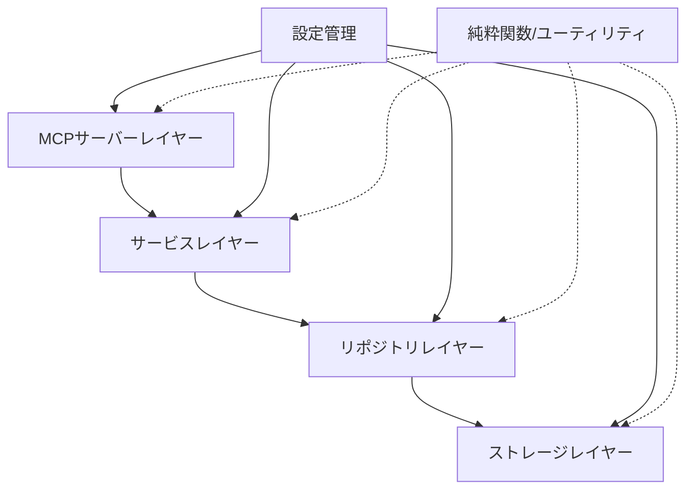

# roo-loggerリファクタリング計画

## 1. 現状の課題

- コードの責任分離が不十分（`index.ts`に多くのロジックが集中）
- ストレージ層の抽象化がなく、将来的なデータベース対応などの拡張が困難
- 設定管理が硬直的
- テスタビリティの向上が必要

## 2. リファクタリングの目標

- 振る舞いを変えずに可読性と保守性を向上させる
- 将来的なスキーマ変更やストレージ方法（データベースなど）の拡張に備えたアーキテクチャに変更
- 各コンポーネントの責任を明確に分離
- 関数型プログラミングアプローチの採用によるコードの簡潔化と予測可能性の向上
- テストのしやすさを向上

## 3. アーキテクチャの提案

純粋関数を中心とした関数型アプローチを採用し、以下のレイヤーに分割します：



## 4. 関数型アプローチの採用

- **イミュータビリティの重視**: すべてのデータ構造をイミュータブルとして取り扱う
- **副作用の分離**: 純粋な計算と副作用を持つ操作を明確に分離
- **型エイリアス（type）の優先使用**: 状態を持たないデータ型はinterfaceではなくtypeを使用
- **関数合成**: 複雑な操作を小さな関数の組み合わせとして表現
- **オプション型と結果型**: nullやundefinedの代わりにOption/Maybe型やResult/Either型を活用
- **パイプライン処理**: データ変換を関数のパイプラインとして表現

## 5. 新しいディレクトリ構造

```
src/
  ├── config/              # 設定管理
  │   └── config.ts        # アプリケーション設定（純粋関数ベース）
  ├── constants/           # 定数定義
  │   └── index.ts         # 共通の定数
  ├── domain/              # ドメインモデル
  │   ├── models/          # 値オブジェクト（イミュータブル）
  │   └── types/           # 型定義（typeベース）
  ├── repositories/        # データアクセス抽象化層
  │   ├── types/           # リポジトリ型定義
  │   └── implementations/ # 具体的な実装
  ├── services/            # ビジネスロジック層
  │   ├── types/           # サービス型定義
  │   └── implementations/ # 具体的な実装
  ├── storage/             # ストレージ抽象化層
  │   ├── types/           # ストレージ型定義
  │   └── implementations/ # 具体的な実装（ファイル、将来的にはDB等）
  ├── utils/               # 純粋関数ユーティリティ
  │   ├── search.ts        # 検索ユーティリティ
  │   ├── date.ts          # 日付操作ユーティリティ
  │   └── functional.ts    # 関数型プログラミングユーティリティ
  ├── server/              # MCPサーバー関連
  │   ├── handlers/        # リクエストハンドラー
  │   └── server.ts        # サーバー初期化
  └── index.ts             # エントリーポイント（簡略化）
```

## 6. 具体的なリファクタリングステップ

### 6.1 ドメインモデルの整理

- `types.ts`を`domain/types/`ディレクトリに移動し、関連するタイプごとにファイルを分割
- 状態を持たない型定義を`interface`から`type`に変更
- イミュータブルな値オブジェクトとして`ActivityLog`を再定義

```typescript
// domain/types/activity-log.ts
export type ActivityType = typeof ActivityTypes[keyof typeof ActivityTypes];
export type LogLevel = typeof LogLevels[keyof typeof LogLevels];

// イミュータブルな値オブジェクトとして定義
export type ActivityLog = Readonly<{
  id: string;
  timestamp: string;
  type: ActivityType;
  level: LogLevel;
  summary: string;
  details?: Readonly<Record<string, unknown>>;
  intention?: string;
  context?: string;
  parentId?: string;
  sequence?: number;
  relatedIds?: readonly string[];
}>;

// 検索条件を表す型
export type SearchCriteria = Readonly<{
  type?: ActivityType;
  level?: LogLevel;
  startDate?: string;
  endDate?: string;
  searchText?: string;
  // 他の検索条件
}>;
```

### 6.2 関数型ユーティリティの作成

- 純粋関数を中心としたユーティリティを作成
- 関数合成やパイプラインをサポートする基本ユーティリティを実装

```typescript
// utils/functional.ts
export const pipe = <T>(...fns: Array<(arg: T) => T>) =>
  (value: T): T => fns.reduce((acc, fn) => fn(acc), value);

export const compose = <T>(...fns: Array<(arg: T) => T>) =>
  (value: T): T => fns.reduceRight((acc, fn) => fn(acc), value);

// 結果型の定義
export type Result<T, E = Error> =
  | { success: true; value: T }
  | { success: false; error: E };

// 成功結果を作成
export const success = <T>(value: T): Result<T> => ({
  success: true,
  value
});

// 失敗結果を作成
export const failure = <E>(error: E): Result<never, E> => ({
  success: false,
  error
});
```

### 6.3 設定管理の改善

- 純粋関数ベースの設定管理を実装
- 環境変数の読み取りと設定のマージを副作用と分離

```typescript
// config/config.ts
import { pipe } from '../utils/functional';

export type LoggerConfig = Readonly<{
  logsDir: string;
  logFilePrefix: string;
  logFileExtension: string;
}>;

// デフォルト設定
export const DEFAULT_CONFIG: LoggerConfig = {
  logsDir: process.env.LOGS_DIR || path.join(process.cwd(), 'logs'),
  logFilePrefix: 'roo-activity-',
  logFileExtension: '.json'
};

// 設定をマージする純粋関数
export const mergeConfig = (
  defaultConfig: LoggerConfig,
  overrides?: Partial<LoggerConfig>
): LoggerConfig => ({
  ...defaultConfig,
  ...overrides
});

// 設定の検証（純粋関数）
export const validateConfig = (config: LoggerConfig): Result<LoggerConfig, string> => {
  if (!path.isAbsolute(config.logsDir)) {
    return failure(`ログディレクトリは絶対パスで指定する必要があります: ${config.logsDir}`);
  }
  return success(config);
};

// 設定の読み込み（副作用を含む関数）
export const loadConfig = (overrides?: Partial<LoggerConfig>): Result<LoggerConfig, string> => {
  try {
    const config = mergeConfig(DEFAULT_CONFIG, overrides);
    return validateConfig(config);
  } catch (error) {
    return failure(`設定の読み込みに失敗しました: ${error}`);
  }
};
```

### 6.4 ストレージ層の抽象化

- 関数型アプローチに基づくストレージ層を実装
- interfaceよりも関数の型定義を優先

```typescript
// storage/types/storage.ts
import { Result } from '../../utils/functional';
import { ActivityLog } from '../../domain/types/activity-log';

// ストレージオプション型
export type StorageOptions = Readonly<{
  directory: string;
  filePrefix?: string;
  fileExtension?: string;
}>;

// ログ保存関数の型
export type SaveLogFn = (
  log: ActivityLog,
  options: StorageOptions
) => Promise<Result<string, string>>;

// ログ検索関数の型
export type GetLogsFn = (
  options: StorageOptions & {
    startDate?: string;
    endDate?: string;
  }
) => Promise<Result<ActivityLog[], string>>;

// ログファイル取得関数の型
export type GetLogFilesFn = (
  options: StorageOptions & {
    limit?: number;
    offset?: number;
  }
) => Promise<Result<string[], string>>;

// ストレージプロバイダーの型
export type StorageProvider = Readonly<{
  saveLog: SaveLogFn;
  getLogs: GetLogsFn;
  getLogFiles: GetLogFilesFn;
}>;
```

### 6.5 ファイルシステムストレージの実装

- 純粋関数と副作用を分離したファイルシステム実装

```typescript
// storage/implementations/file-system.ts
import { promises as fs } from 'fs';
import path from 'path';
import { format } from 'date-fns';
import {
  StorageProvider,
  StorageOptions
} from '../types/storage';
import { ActivityLog } from '../../domain/types/activity-log';
import {
  Result,
  success,
  failure,
  pipe
} from '../../utils/functional';

// ファイル名を生成する純粋関数
const getLogFileName = (
  date: Date,
  prefix: string,
  extension: string
): string =>
  `${prefix}${format(date, 'yyyy-MM-dd')}${extension}`;

// ディレクトリの存在を確認し作成する副作用関数
const ensureDirectory = async (dir: string): Promise<Result<string, string>> => {
  try {
    await fs.access(dir);
    return success(dir);
  } catch {
    try {
      await fs.mkdir(dir, { recursive: true });
      return success(dir);
    } catch (error) {
      return failure(`ディレクトリの作成に失敗しました: ${error}`);
    }
  }
};

// ログを保存する関数
const saveLog: SaveLogFn = async (log, options) => {
  try {
    const dirResult = await ensureDirectory(options.directory);
    if (!dirResult.success) return failure(dirResult.error);

    const fileName = getLogFileName(
      new Date(),
      options.filePrefix || 'roo-activity-',
      options.fileExtension || '.json'
    );
    const filePath = path.join(options.directory, fileName);

    // 既存ファイルの読み込み
    let logs: ActivityLog[] = [];
    try {
      const fileContent = await fs.readFile(filePath, 'utf-8');
      logs = JSON.parse(fileContent);
    } catch {
      // ファイルが存在しない場合は空の配列
    }

    // 新しいログを追加（イミュータブルな操作）
    const updatedLogs = [...logs, log];

    // ファイルに書き込み
    await fs.writeFile(filePath, JSON.stringify(updatedLogs, null, 2), 'utf-8');

    return success(log.id);
  } catch (error) {
    return failure(`ログの保存に失敗しました: ${error}`);
  }
};

// ログを取得する関数
const getLogs: GetLogsFn = async (options) => {
  // 実装省略
};

// ログファイル一覧を取得する関数
const getLogFiles: GetLogFilesFn = async (options) => {
  // 実装省略
};

// ファイルシステムストレージプロバイダー
export const fileSystemStorage: StorageProvider = {
  saveLog,
  getLogs,
  getLogFiles
};
```

### 6.6 リポジトリレイヤーの実装

- 関数型アプローチに基づくリポジトリレイヤーを実装

```typescript
// repositories/types/activity-log-repository.ts
import { Result } from '../../utils/functional';
import { ActivityLog, SearchCriteria } from '../../domain/types/activity-log';

// 検索結果型
export type SearchResult<T> = Readonly<{
  total: number;
  items: readonly T[];
}>;

// ログファイル取得オプション
export type FileOptions = Readonly<{
  limit?: number;
  offset?: number;
  prefix?: string;
  extension?: string;
}>;

// リポジトリの型定義（関数の集合として）
export type ActivityLogRepository = Readonly<{
  save: (log: ActivityLog) => Promise<Result<string, string>>;
  search: (criteria: SearchCriteria) => Promise<Result<SearchResult<ActivityLog>, string>>;
  getLogFiles: (options: FileOptions) => Promise<Result<string[], string>>;
}>;
```

### 6.7 サービスレイヤーの実装

- 関数型アプローチに基づくサービスレイヤーを実装

```typescript
// services/types/activity-log-service.ts
import { Result } from '../../utils/functional';
import { ActivityLog } from '../../domain/types/activity-log';
import { SearchResult } from '../../repositories/types/activity-log-repository';
import { LogActivityArgs, SearchLogsArgs, GetLogFilesArgs } from '../../domain/types/service-args';

// アクティビティログサービスの型定義
export type ActivityLogService = Readonly<{
  logActivity: (args: LogActivityArgs) => Promise<Result<string, string>>;
  searchLogs: (args: SearchLogsArgs) => Promise<Result<SearchResult<ActivityLog>, string>>;
  getLogFiles: (args: GetLogFilesArgs) => Promise<Result<string[], string>>;
}>;
```

### 6.8 MCPサーバー層のリファクタリング

- 関数型アプローチを取り入れたハンドラー実装

```typescript
// server/handlers/log-activity-handler.ts
import { CallToolRequestParams } from '@modelcontextprotocol/sdk/types.js';
import { ActivityLogService } from '../../services/types/activity-log-service';
import { LogActivityArgs } from '../../domain/types/service-args';

// ハンドラー関数の型定義
export type LogActivityHandler = (
  request: { params: CallToolRequestParams },
  service: ActivityLogService
) => Promise<any>;

// ハンドラー関数の実装
export const handleLogActivity: LogActivityHandler = async (request, service) => {
  const args = request.params.arguments as LogActivityArgs;
  const result = await service.logActivity(args);

  if (result.success) {
    return {
      content: [
        {
          type: 'text',
          text: `活動を記録しました。ログID: ${result.value}`,
        },
      ],
    };
  } else {
    return {
      content: [
        {
          type: 'text',
          text: `エラー: ${result.error}`,
        },
      ],
      isError: true,
    };
  }
};
```

### 6.9 メインファイルの簡素化

- 純粋関数とコンポーネント合成による明確なエントリーポイント

```typescript
// index.ts
import { Server } from '@modelcontextprotocol/sdk/server/index.js';
import { StdioServerTransport } from '@modelcontextprotocol/sdk/server/stdio.js';
import { loadConfig } from './config/config';
import { fileSystemStorage } from './storage/implementations/file-system';
import { createActivityLogRepository } from './repositories/implementations/activity-log-repository';
import { createActivityLogService } from './services/implementations/activity-log-service';
import { createMCPServer } from './server/server';

async function main() {
  try {
    // 設定の読み込み
    const configResult = loadConfig();
    if (!configResult.success) {
      console.error(`設定の読み込みに失敗しました: ${configResult.error}`);
      process.exit(1);
    }
    const config = configResult.value;

    // コンポーネント合成（依存性注入）
    const storage = fileSystemStorage;
    const repository = createActivityLogRepository(storage);
    const service = createActivityLogService(repository, config);
    const server = createMCPServer(service);

    // サーバー起動
    const transport = new StdioServerTransport();
    await server.connect(transport);
    console.log('Roo Activity Logger MCPサーバーがstdioで実行中です');
  } catch (error) {
    console.error('サーバーの起動に失敗しました:', error);
    process.exit(1);
  }
}

// サーバーの実行
main().catch(console.error);
```

## 7. テスト戦略

- **純粋関数のテスト**: プロパティベーステストを活用して関数の特性を確認
- **副作用のテスト**: モックを使用した副作用の分離テスト
- **統合テスト**: 実際のファイルシステムを使用した統合テスト
- **E2Eテスト**: MCPクライアントを使用した実際のリクエスト/レスポンステスト

## 8. マイグレーション戦略

段階的なリファクタリングを行い、各ステップでテストを実行して機能が維持されていることを確認します。

1. 関数型プログラミングユーティリティの作成
2. ドメインモデルをtype中心に再定義
3. 設定管理の純粋関数化
4. ストレージ層・リポジトリ層・サービス層の抽象化と実装
5. MCPサーバー層の改善
6. エントリーポイントの再構成

この関数型アプローチによるリファクタリングで、より予測可能で保守しやすく、将来の拡張にも対応できるコードベースを実現します。